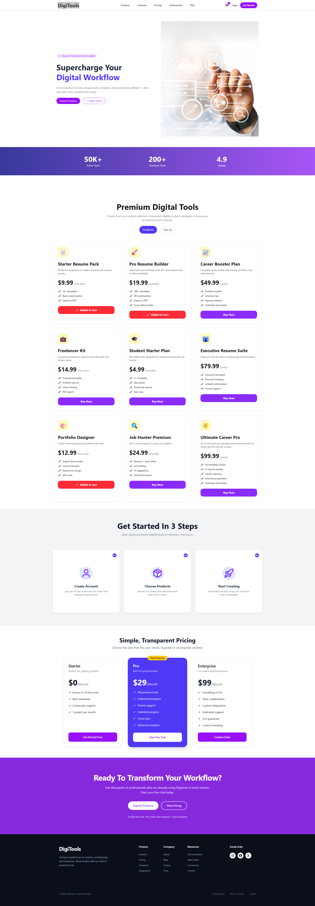

# 🚀 DigiTools

## 📌 Description
DigiTools is an AI-powered platform where users can purchase subscriptions for various AI tools. These tools help increase productivity and improve workflow efficiency.

---

## 🛠️ Technologies Used
- React  
- Tailwind CSS  
- React Icons  
- React Toastify  
- DaisyUI  

---

## ✨ Features
- 🚀 AI Subscriptions: Users can purchase subscriptions for different AI tools, helping them boost productivity and work efficiency.  
- 🌐 Global Access: DigiTools can be accessed from anywhere, on any device, ensuring a smooth and flexible user experience.  
- 🔒 Secure Data Management: All user data and subscription information are securely stored and protected with modern security practices.  

---

## 📷 Preview (Optional)


---

## 📦 Installation (Optional)
```bash
git clone https://github.com/your-username/your-project.git
cd your-project
npm install
npm start